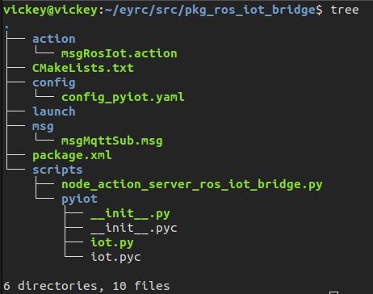
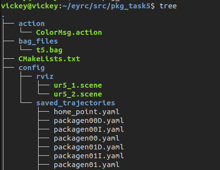
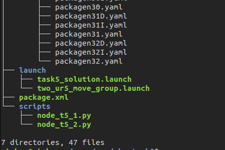
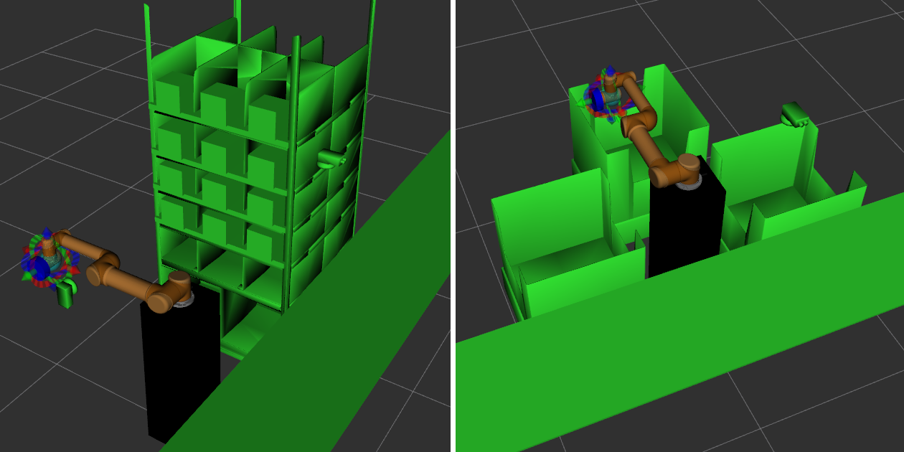

## *API Documentation*

In this section, we will discuss about the API's that are used in this theme
to complete the objectives mentioned.

We have used following ROS packages


- pkg_ros_iot_bridge
- pkg_task5
- pkg_moveit_ur5_1 and ur5_2


#### pkg_ros_iot_bridge
This is one of the main packages which is required to complete the objective.
As this theme is concentrating on development of Automated Warehouse Management System and as we know that an autonomous system needs to do the job on it's own. So, It will receive orders only through IOT i.e., HiveMq and all the status are updated again to the internet medium. So, there is a need of an API which can act as a Bridge between IOT and ROS.

As this package is a bridge between ROS and IOT, we need to know the working of this package. We have included the tree of the package , we will discuss all the files and their usage on this package.




**config_pyiot.yaml**

To make this package act as a bridge there are certain parameters to be loaded to the ROS Master. This config_pyiot.yaml makes the parameter to be published. All the mqtt topics, ros topics and spreadsheet ids are stored in this yaml file. Hence it can be used in the ROS-IOT action server.
Important ros and mqtt topics are listed below

```yaml
    # MQtt Topic on which all the orders are sent
    topic_sub: "/eyrc/vb/BiAdKaHa/orders" # Unique ID = BiAdKaHa
    # ROS nodes can listen to this topic to receive data from MQTT
    sub_cb_ros_topic: "/ros_iot_bridge/mqtt/sub"
```

Apart from the mqtt and ROS topics, this file also contains the google spreadsheet's webapp ID. This webapp Id can be used to push data to the google sheets.
```yaml
google_apps:
    //spreadsheet id of our team
    spread_sheet_id: AKfycbxZjLKDKs_WZ6DHznHcRSnoy2_bh68jGCpYCY4dtaQXAVcoszN8VL4_
    //spreadsheet id of the hosts
    submission_spread_sheet_id: AKfycbw5xylppoda-8HPjt2Tzq4ShU_Xef-Ik-hEtBPcPk0gdGw8095j4RZ7
```

**message and action files**

These message and action files are used to send and receive data between both ROS nodes and Iot Servers.


The Usage of the message file is to store the data of the incoming orders and use the file to publish the same in required format.


    time timestamp  //stores the timestamp of the incoming orders
    string topic    //stores the topic in which the orders are received
    string message  //stores the incoming orders in string format

The usage of action files will come into picture when other ROS nodes try to send data to this ROS-IOT action server. So, to receive goal, get feedback and result of the goal. There should be appropriate action files present in the package. The action file used in this package is displayed here.


```yaml
# goal //stores all the incoming goals from client
string dispatch_time
string shipped_time
string sheet_name
string order_id
string city
string package_name
string package_color
string dispatch_status
string shipped_status
---
# result // returns the status of the goal once it is processed
bool flag_success
---
# feedback // to get the status of the goal while processing
int8 percentage_complete
```

**node_action_server_ros_iot_bridge.py**

This ros node can get all the data that are published in MQTT Topic with the help of pyiot module. The usage of pyiot module is to do multiprocessing which can parallelly do all the communications between various IOT applications. We have included all the functions present in this node with their descriptions.


```python
# ROS Node - Action Server - IoT ROS Bridge
'''
This python file runs a ROS-node of name  IotRosBridgeActionServer.
This node is the bridge between ROS and IOT.
This node acts as an Action Server
So it will process the goals Asynchronously
This node subscribes to the mqtt topic to receive incomingorders
This node also publishes the orders received to ros topic
All the data are pushed to the spreadsheets using pyiot module
'''

# Importing all Required Modules
import threading                           // For asynchronous perfomance
from datetime import datetime, timedelta   // To get system time and to add dates
import json                                // to convert the incoming orders to dictionary
import rospy                               // To use ROS functions
import actionlib						   // Actionlib library for ROS Communication
# Action and Result fields of msgROSIOT.action file for updating status of goal
from pkg_ros_iot_bridge.msg import msgRosIotAction, msgRosIotResult
# msgMqttSub.msg for publishing the incoming orders to ROS publisher
from pkg_ros_iot_bridge.msg import msgMqttSub
# Importing Custom IOT Module to communicate between ROS and IOT
from pyiot import iot

# Class IotRosBridegeActionServer
class IotRosBridgeActionServer(object):
    """
    Class IotRosBridgeActionServer is a action server
    to node_t5_1 and node_t5_2
    """
    # This is a callback function for MQTT Subscriptions
    def mqtt_sub_callback(self, client, userdata, message):
        Description : 
            This is a callback function for mqtt Subscription
            This is function is called whenever, there is a order from the user
        	This function is also threaded to push incoming order to spreadsheet
        arguments :
        	client - get the client id
        	userdata - get the userdata if any available
        	message - get the orders placed by the client
        result : 
            Gets the incoming order and publish it in ROS topic

    # This function will be called when Action Server receives a Goal
    def on_goal(self, goal_handle):
        Description :
            On receiving a goal from client this function will be executed.
            This function will accept the goals which are appropriate
        arguments :
        	goal_handle - Incoming goals from clients
        result : 
            It will either accepts the goal or rejects the goal
       
    # This function is a separate thread to process Goal.
    def process_goal(self, goal_handle):
        Description :
            This function is the process goal Asynchronously
            and calls the appropriate function
            to push data to spreadsheet
        arguments :
        	goal_handle - Incoming goals from clients
        result : 
            send the goal to next stage of process and sends 
        		status of goal to clients. 
        
    # Function to push data to Inventory Sheet
    @classmethod
    def func_pushdata_inventory(cls, goal):
		Description :
            This function is to push package data in shelf to
            Inventory spreadsheet using pyiot module.
        arguments :
        	goal - goal from action client
        result : 
            push the data to inventory sheet using IOT module.
         
    #Function to push data to incoming orders sheet
    @classmethod
    def func_pushdata_orders(cls, message):
        Description : 
            This function is to push incoming orders to IncomingOrders 
            spreadsheet using pyiot module
        arguments :
        	message - incoming orders from the client
        result : 
            push the data to IncomingOrders sheet using IOT module.
      
    # Function to push data to OrdersDispatched Sheet
    @classmethod
    def func_pushdata_dispatch(cls, goal):
        Description : 
            This function is to push Dispatched orders to
            OrdersDispatched spreadsheet using pyiot module
        arguments : 
            goal - goal from action client  
        result :
            push the data from goal to OrdersDispatched sheet using IOT module.
    
    # Function to push data to Ordersshipped Sheet
    @classmethod
    def func_pushdata_shipped(cls, goal):
        Description :
            This function is to push Shipped package orders to
            OrdersShipped spreadsheet using pyiot module
        arguments :
            goal - goal from action client
        result :
            push the data from goal to OrdersShipped sheet using IOT module
         
    #Function to cancel a goal
    @classmethod
    def on_cancel(cls, goal):
        Description : 
            This function is to cancel any incoming goal
            which is requested by the client
        arguments :
            goal - goal sent by action client
        result :
            cancels the incoming goal by goal id
        
```

#### pkg_task5
This is another important package being used in this theme.
This ROS package takes complete control of all ROS and Gazebo operations. This package will handle all the incoming orders from the IOT-Bridge, to make appropriate pick and place by ur5_1 arm, then sort the packages with the help of ur5_2 arm.


Let us see the tree of this package to get to know the files used and their function one by one.







##### **launch files**

The first necessary thing this package needs to do is launching the simulation environment and all the services files required to complete the tasks.

###### *two_ur5_move_group.launch*

The two_ur5_move_group.launch file will launch the rviz gui for both ur5 arms in two separate windows. The necessity of rviz to avoid collisions that can happen with the objects present in the simulation world. This launch file is integrated with task5_solution file for easy execution.

###### *task5_solution.launch*

The task5_solution.launch file is the main launch file which will be executed at the start of the run. This file will launch the gazebo world with the simulation environment. This file also extends the move group launch file by including the scene file in the respective arms window to avoid collisions.
This file also provides an option to record the vacuum_gripper activities of each ur5 arm. With this, we can verify whether the arms are doing their tasks properly.

##### **Config and Action files**

<div align="justify">
These files are add on to the objective which will give a better performance for this theme.

###### *Config files*

In rviz folder there are two scene files namely ur5_1 and ur5_2. The purpose of these scene file is to add all the possible collision objects to the rviz and store them. Then, the stored scene files will be loaded to the rviz gui by the use of launch file.


In saved trajectories folder there are thirty seven files. These files are saved trajectories for all the motions that the ur5_1 arm is going to perform. The advantage of this folder to be present in this theme is to execute trajectories without planning a motion with collision aware IK as it's performed earlier and stored it in as a file. The other benefit is that the motion planned is a very optimal trajectory, So that the pick and place can be done as quickly as possible.

###### *Action files*


These files will be used for communication between ROS Nodes. These action files will contain all the necessary fields for the goals, feedback and result. We have used colorMsg.action file to carry out the ROS Communication between an action server and action client.


    # goal //goals to be sent to action server for further processing.
    string name
    string color
    string orderid
    string city
    string time
    int32 simtime
    ---
    # result // Stores the result of the processed goals.
    bool flag_success
    ---
    # feedback //stores the status of each goal.
    int8 percentage_complete

##### **ROS scripts**

ROS scripts is the core of this theme. The ROS Nodes present in this package are the atomic units which will use all other files that are present in this package.


###### *node_t5_1.py*

This ROS Node is specifically used for ur5_1 arm and it can interface the moveit package of ur5_1 arm to control the arm. The first task that this script needs to do is to use a 2D camera to process the images of the shelf and extract the color of the packages present in the shelf. This Node can also  receive incoming orders from the ROS publisher using msgMqttSub which is present in ROS-IOT server package. After receiving the orders, it will be applied to the algorithm to make priority if there are multiple goals to be processed.

There are two classes in the node for handling the operations. One class is created separately for the 2D camera. The other Class of this node will handle the incoming goals and manipulate the required packages based on priority.

 We have included all the functions present in this node with their descriptions.

```python
# ROS Node - Robotic Perception and Manipulation - Ur5#1
'''
This python file runs a ROS-node of name Ur51Node.
This node acts as a Action client for both Ur5_2 server and ROS-IOT server.
So it will send the goals asynchronously to both servers
This Node contains two classes one for the 2d camera and ur5_1
Class 2d camera detects the package color and name
Class ur5_1 makes the arm to pick and place the package
'''

# Importing all the Required Modules
import threading                              // For asynchronous perfomance
import datetime                               // To get system time
import json                                   // To convert the incoming orders to dictionary
import rospy                                  // To use ROS python functions
import actionlib			                  // Actionlib library for ROS
import rospkg				                  // To get the required files
import yaml									  // To use saved trajectories
import moveit_commander                       // To interface ur5 arm
import moveit_msgs.msg                        // To get the states of the arm
from sensor_msgs.msg import Image             // To get the sensor messages of 2D camera
from cv_bridge import CvBridge, CvBridgeError // To bridge the raw_data to image format
from pyzbar.pyzbar import decode              // To decode the QR code
from pkg_vb_sim.srv import vacuumGripper      // To use the vacuum Gripper service
# Action, Goal and Result fields of ColorMsg.action file to access different fields of ROS Actions
from pkg_task5.msg import ColorMsgAction, ColorMsgGoal, ColorMsgResult
# Action, Goal and Result fields of msgROSIOT.action file to access different fields of ROS Actions
from pkg_ros_iot_bridge.msg import msgRosIotAction, msgRosIotGoal, msgRosIotResult
# msgMqttSub.msg for subscribing the incoming orders from  ROS publisher
from pkg_ros_iot_bridge.msg import msgMqttSub
# Importing cv2 Module for image processing
import cv2

# Create a Class Camera1
class Camera1(object):
    '''Class Camera1'''
    
    This is the image processing unit of this node.
    This class will detect the package color which is present in shelf
   
    # Function for camera
    def camera(self):
        Description : 
        	This function is an infinite loop which subscribes to the ROS topic
        of 2d camera to get the input.
        ROS Subscriber :
            rospy.Subscriber("/eyrc/vb/camera_1/image_raw", Image, self.callback)
        arguments :
            NONE
        result :
            returns the package color extracted using image processing 
            return type : list
        
    # CallBack Function for Camera subscriber
    def callback(self, data):
        Description :
        	This is callback function for camera
        	This function will convert the raw image to bgr8 and calls
        qr detect function
        arguments : 
        	data - raw_image from ros subscriber
        result :
        	push the image to qr detect function
 
    # Function to detect QR_Code
    def qr_detect(self, arg_image):   
        Description :
            This function calls process the images from 2d camera
            It will crop the image, convert color to grayscale and makes
            threshold and decode the qr codes.
        arguments :
        	arg_image - image matrix from callback function
        result :
        	push the data to re-arranging function
       
    # Function to rearrange Image codes
    def rearrange_img(self, codes):
        Description :
        	This function re-arranges the decoded data
        	By using the decoded data Re-arrangement is made to get
        decoded package color in order.
        arguments :
        	codes - decoded values from qr_detect
        result :
            re-arrange image and store it in a list
      
# Creating a class Ur5_1_Node
class Ur51Node(object):
    '''class Ur51Node'''
    This class acts as a action client for ur5_2 server and ROS-IOT server
    This class has algorithm to prioritize the package from incomingorders
    This class also do the pick and place operation
    
    
    # Function to store the color of the package detected in Camera Class
    def func_store(self):
        Description : 
        	This function is store the package name and color which is
        	extracted from camera class
        	This function is also integrated with a thread which can
        	push data to ROS-IOT server asynchronously while making the
        	arm to move from allZeros to home_point.
        arguments : 
            NONE
        result :
            stores the extracted value from camera1

    # Function to receive orders
    def func_mqtt(self):
        Description :
        	This function subscribes to the topic /ros_iot_bridge/mqtt/sub
        	to receive the goals which is published from IOT server
        	This function also makes the call to func_algorithm
        arguments :
            NONE
        ROS Subscriber :
            rospy.Subscriber('/ros_iot_bridge/mqtt/sub', msgMqttSub, self.mqtt_callback)
        result :
			orders received will be pushed to algorithm
      
    # Callback Function for Mqtt Subscription
    def mqtt_callback(self, msg):
        Description :
        	This is a callback function which will execute when order is
        	published in ros topic and converts them to required format.
        	This function will also assign different parameters to various
        	lists which is used later on.
        arguments : 
            msg -  message received from ros subscriber
        result : 
            converts the received message to suitable form of processing
            
    # Function Algorithm to Prioritize Packages
    def func_algorithm(self, *args):
        Description :
        	This function algorithm will prioritize the packages if there are
        	multiple orders to be processed.
        	This function also deletes the processed elements from the list.
        arguments :
            This is a variadic function which will contain multiple arguments.
            * args - It has priority, pick color, orderid, city, time,
            		 simulationtime
        result :
            prioritze the package and sends the function task

    # Function to Send Goal to IOT server
    def send_goal_iot(self, *args):
        Description :
        	This function will send goals to the IOT server from this Node using
        	msgRosIot.Action file
        arguments :
            This is a variadic function which will contain multiple arguments.
            * args - It has sheetname, package name, package color, dispatch status
            		 orderid, city, dispatch time
      	result :
            sends the goal to ROS IOT server
    # Function to send goals to Action Server
    def send_goal_ur5_2(self, *args):
        Description :
        	This function will send goals to the Ur5_2 server from this Node using
        	ColorMsg.Action file
        arguments :
            This is a variadic function which will contain multiple arguments.
            * args - It has package name, package color, orderid, city, time,
            		 simulation time
      	result :
            sends the goal to UR5_2 server
     
    # Function to get the state of sent Goal
    def on_transition1(self, goal_handle):
        Description :
        	This function monitor the states of all the goals which is sent to
        	ROS-IOT server
        	This function will give the current state of each goal.
        arguments :
            goal_handle - stacked up goals from send_goal function
        result :
            gives the result from the iot server

    # Function to get the state of sent Goal
    def on_transition2(self, goal_handle):
        Description :
        	This function monitor the states of all the goals which is sent to
        	Ur5_2 server.
        	This function will give the current state of each goal
        arguments :
            goal_handle - stacked up goals from send_goal function
        result :
            gives the result from the ur5_2 server
        
    # Function to push data to Iot Action Server
    def push_data(self, *args):
        Description :
        	This function is to pre-process the goals which is to be sent to IOT
        	server using send goal function
        	This function has a if statement according to the sheet name to send
        	goals to the IOT server
        arguments :
            This is a variadic function which will contain multiple arguments.
            * args - It has sheetname, package name, package color, dispatch status
            		 orderid, city, time, dispatch time
      	result :
            push the goal to ROS IOT server

    # Function to complete the task
    def func_task(self, *args):
        Description :
        	This function is used to search the prioritized package
        	avaliability in shelf and send the goal to ur5_2 server
        	Once the specified package is identified then the
        	package name and color are removed in the Inventory
        arguments :
            This is a variadic function which will contain multiple arguments.
            * args - It has package color, orderid, city, time, simulation time
      	result :
           calls the function pick and place

    # Function to pick and place the package in conveyor
    def pick_and_place(self, *args):
        Description :
        	This function makes the arm to pick and place the packages from the
        	shelf to the conveyor
        	The pick and place operation uses pre-defined trajectories which is
        	saved as yaml files in pkg_task5
        	This function also implemented with a thread to push data to
        	Iot server
   		arguments :
            This is a variadic function which will contain multiple arguments.
            * args - It has package name, package color, orderid, city, 
            		 time, simulation time
      	result :
           	moves the ur5_1 arm to pick the package from shelf and place it in the 
        	conveyor
    
    # Function to play planned path
    def moveit_play_planned_path_from_file(self, arg_file_path, arg_file_name):
        Description :
        	This function will play the planned path which is saved in the format
        	of yaml file in pkg_task5
        Arguments :
            arg_file_path - file path in which the trajectories are saved
            arg_file_name - file name of saved trajectories that we need to load
        result :
            plays the loaded yaml file.
            
    # Function to Hard play planned path
    def moveit_hard_play_planned_path_from_file(self, arg_file_path, arg_file_name, arg_max):
        Description :
        	This will play the trajectories multiple times so that
        	trajectories will not fail.
        Arguments :
            arg_file_path - file path in which the trajectories are saved
            arg_file_name - file name of saved trajectories that we need to load
            arg_max       - maximum no of attempts
        result :
            gives the result as true or false for the execution of the trajectories
   
```

###### *node_t5_2.py*

This ROS Node is used for ur5_2 arm and it can interface the moveit package of ut5_2 arm to control the arm. The task of this arm starts only when the ur5_1 arm dispatches the prioritized orders and sends the goal to the server present in this node. On receiving goals from the client it will sort the packages from conveyor to the respective bins based on the color. The first thing that this node needs to do is interface the ur5_2 arm in gazebo with moveit planners. This will be carried out by the constructor of the class UR52Node where all the parameters of the manipulator is loaded.

 We have included all the functions present in this node with their descriptions.

```python
# ROS Node - Robotic Perception and manipulation - Ur5#2
'''
This python file runs a ROS-node of name Ur52Node.
This node acts as a Action Server and this node is also an Action
client to ROS-IOT server.
So it will receive and send the goals asynchronously to the
respective nodes
This nodes controls the ur5_2 arm to pick the packages from the
conveyor belt and drops the package in the respective bins
Sorting is done by the goal received from the Action Client
'''
# Importing required modules
import datetime                                // To get system time
import math                                    // To convert degree to radians
import copy		                               // To make a copy of waypoints
import threading                               // For asynchronous perfomance
import rospy                                   // To use ROS python functions
import actionlib                               // Actionlib library for ROS
import moveit_commander                        // To interface ur5 arm
import moveit_msgs.msg                         // To get the states of the arm
import geometry_msgs.msg                       // To use the geometry msgs of ROS
from pkg_vb_sim.msg import LogicalCameraImage  // To get the messages from LogicalCamera2
# To use the vacuum Gripper service, ConveyorBeltService
from pkg_vb_sim.srv import conveyorBeltPowerMsg, vacuumGripper 
# Action and Result fields of ColorMsg.action file to access different fields of ROS Actions
from pkg_task5.msg import ColorMsgAction, ColorMsgResult
# Action, Goal and Result fields of msgROSIOT.action file to access different fields of ROS Actions
from pkg_ros_iot_bridge.msg import msgRosIotAction, msgRosIotGoal, msgRosIotResult

# Creating a Class Ur52Node
class Ur52Node(object):
    '''Class UR52Node'''
    This class will act as controller for ur5_2 arm to pick the
    packages from the conveyor belt and drops it in the corresponding
    colored bins
    
    # Function to call neccesary parameters
    def func_nec(self):
        Description :
        	This functions purpose to initialize several parameters and
        	joint angles to make the arm work properly
        arguments :
        	NONE
        results :
        	Initialize the neccessary services and joint angles
        
    # Function to validate incoming goal
    def on_goal(self, goal_handle):
        Description :
            On receiving a goal from client this function will be executed.
            This function will accept the goals which are appropriate
        arguments :
            goal_handle - Incoming goals from clients
        result : 
            It will either accepts the goal or rejects the goal
      
    # This function is to process incoming Goals.
    def process_goal(self, goal_handle):      
        Description :
            This function is the process goal which is received from
        action client to sort the packages
        arguments :
            goal_handle - Incoming goals from clients
        result : 
            send the goal to next stage of process and sends 
                status of goal to clients. 
     
    # Function to Send Goal to IOT server
    def send_goal_iot(self, *args):
        Description :
            This function will send goals to the IOT server from this Node using
            msgRosIot.Action file
        arguments :
            This is a variadic function which will contain multiple arguments.
            * args - It has sheetname, package name, package color, dispatch status
                     orderid, city, dispatch time
        result :
            sends the goal to ROS IOT server
   
    # Function to get the state of sent Goal
    def on_transition(self, goal_handle):
        Description :
            This function monitor the states of all the goals which is sent to
            ROS-IOT server
            This function will give the current state of each goal.
        arguments :
            goal_handle - stacked up goals from send_goal function
        result :
            gives the result from the iot server
        
    # Function to sort the packages
    def func_for_sorting(self, *args):
		Description :
            This function will use the incoming goal parameters and sort
            the packages to the respective bins
            This function first calls some functions to stop the coveyor belt
            at appropriate position and to apply translation to the arm to
            go to the package.
            This function is also threaded to send goals to IOT server
            asynchronously
        arguments :
            This is a variadic function which will contain multiple arguments.
            * args - It has package name, package color, orderid, city, time,
                     simulation time
        results :
            picks the package from conveyor and place it in the respective bins
    
    # Function to push data to ROS-IOT Server
    def push_data(self, *args):
        Description :
            This function is to pre-process the goals which is to be sent to IOT
            server using send goal function
            This function has a if statement according to the sheet name to send
            goals to the IOT server
        arguments :
            This is a variadic function which will contain multiple arguments.
            * args - It has sheetname, package name, package color, dispatch status
                     orderid, city, time, dispatch time
        result :
            push the goal to ROS IOT server
        
    # Function to get translational Values
    def func_translation(self):
        Description :
        this function trasnslation subscribes to the logical camera 2
        topic and applies cartesian translation to make the arm
        move to the package
        arguments : 
        	NONE
        ROS Subscriber :
        	/eyrc/vb/logical_camera_2
        result :
        	push the translational values to ee_cartesian translation function
        return :
       		float - translation_y 

    # Callback Function for translation function
    def func_trans_callback(self, msg):
        Description :
        	this is a callback function to get the translational values
        	which in turn applied in cartesian translation
        arguments : 
            msg -  message received from ros subscriber of logical camera
        result : 
            gets the y co-ordinate of the packages for applying translation
        
    # Function to control conveyor
    def func_control(self):
        Description :
            This function controls the conveyor belt to start and stop
            func_detect is called to detect whether any objects present
            in the belt and then it stops the belt.
		arguments :
            NONE
        result :
            Turn on and off the conveyor belt.
        
    # Function to Detect packages
    def func_detect(self):
        Description :
            this function detects whether there is a package in
            conveyor belt or not using logical camera 2.
            It also returns the val_y so that it can be picked by ur5_2 arm.
        arguments :
            NONE
        result :
            detects the package when it is in specific range
        
    # Callback Function for detect function
    def func_sub_callback(self, msg):
        Description :
        	This function is a callback for func_detect
        	In this function it will check for the packages rather than ur5
        	arm , so that the packages are identified by the camera and
        	returns the y co-ordinate of the objects
        arguments :
            msg - message received from ros subscriber of logical camera 2
        result :
            get the y position of the package
        return :
        	float - value_y
    # Function to power up the conveyor while sorting
    def func_parallel(self):
        Description :
        	this function to run the conveyor belt parallely while sorting
        	the packages
		arguments :
            NONE
        result :
            power up the conveyor belt

    #Function to set_joint_angles to move ur5 arm
    def set_joint_angles(self, arg_list_joint_angles):
        Description :
        	This function to set the joint angles of the ur5_2 arm
        	to the required joint angles as mentioned.
        arguments :
            arg_list_joint_angles - list of joint angle values
       	result :
            Moves the arm to the required joint angles
        
    # Function to set joint angles forcibly
    def hard_set_joint_angles(self, arg_list_joint_angles, arg_max_attempts):
        Description :
        	This function to set the joint angles forcibly of the ur5_2 arm
        	In case, If the arm fails to set the joint angles at the first
        	attempt
        arguments :
            arg_list_joint_angles - list of joint angle values
            arg_max_attempts - maximum number of attempts
        results :
            gives the result as true or false for the execution of the trajectories
            
    # Function for cartesian translation
    def ee_cartesian_translation(self, trans_x, trans_y, trans_z):
        Description :
        	This ee_cartesian_translation function is to move the end effector
        	to the packages, the values are extracted using logical camera 2
        arguments :
            trans_x - x co-ordinate value for translation 
            trans_y - y co-ordinate value for translation
            trans_z - z co-ordinate value for translation
        result :
            translate the arm from current position to top of package
        
    #Function to cancel a goal
    @classmethod
    def on_cancel(cls, goal_handle):
        Description : 
            This function is to cancel any incoming goal
            which is requested by the client
        arguments :
            goal - goal sent by action client
        result :
            cancels the incoming goal by goal id

```

**Note** : If you need to see our complete code,  please check on our submission files.

#### pkg_moveit_ur5_1 and ur5_2

As discussed in the introduction and implementation, In this theme there are two robotic arms to be controlled. To control each arm, there is a need of a configuration package which should load all the parameters and interface the arm in both gazebo and moveit.
We have configured this package on our own instead of the packages that are already available in vb_simulation_pkgs. The reason behind this is to get a best suitable configuration to the ur5 arms and we have also used RRT as a planning library. So, that the arm works better and gives the desired results. This package will have all the files which are necessary to interface and control the arm through move it and ROS nodes. Using the Rviz GUI we have also created a scene file which can use a saved file to avoid collisions with objects present in the gazebo world.


The scene file of ur5_1 and ur5_2 are shown below



